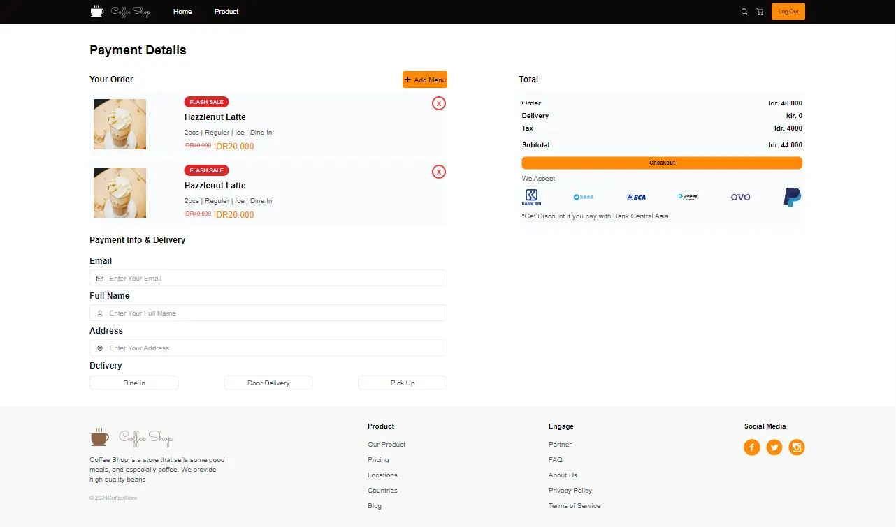
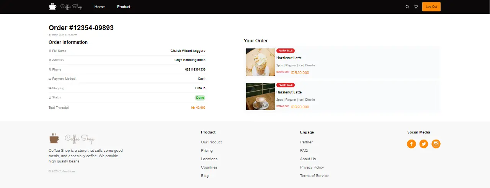
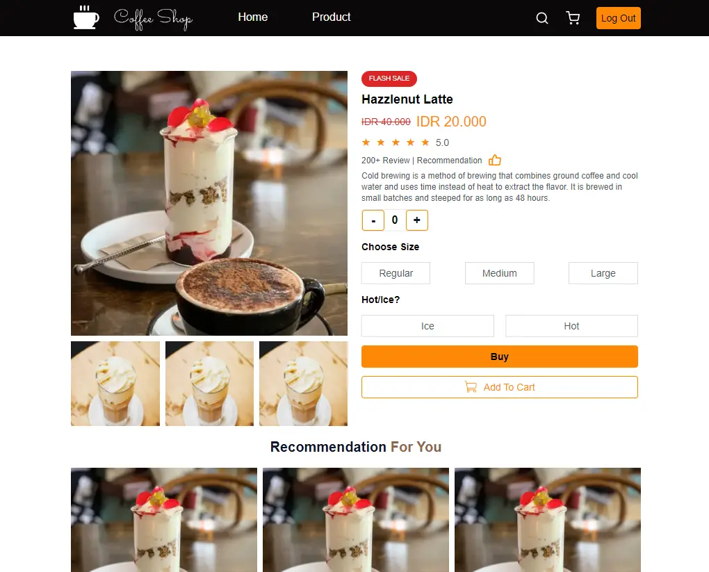
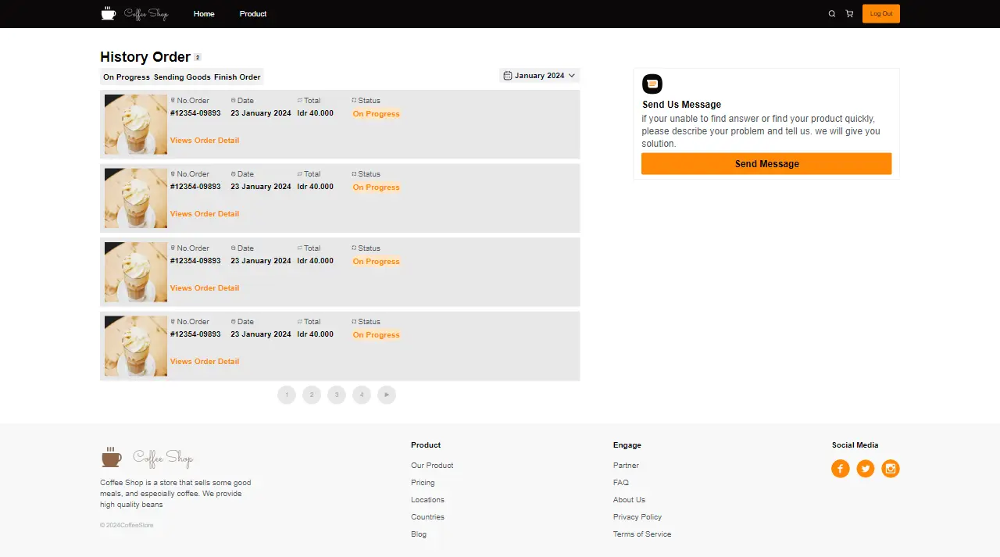

# Coffee Shop App

Coffee Shop App adalah aplikasi sederhana untuk mengelola coffee shop. Aplikasi ini memungkinkan pengguna untuk melakukan registrasi akun, login, menambahkan produk dan melakukan transaksi seperti coffee shop pada umumnya.

## Daftar Isi

1. [Tentang Proyek](#tentang-proyek)
2. [Mulai](#mulai)
3. [Kontak](#kontak)

## Tentang Proyek

Aplikasi Coffee Shop ini dibangun dengan tujuan untuk memudahkan pengguna dalam mengelola usaha coffee shop mereka. Aplikasi ini menggunakan html, css, tailwind css, dan javascript untuk frontend.

### Fitur

- Halaman Index
- Halaman Login
- Halaman Register
- Halaman Profile
- Halaman Product
- Halaman Checkout
- Halaman History Order
- Halaman Detail Product
- Halaman Detail Order

### Teknologi

- HTML
- CSS
- Tailwind CSS
- Javascript

### Screenshot









## Mulai

1. Clone repositori ini

```bash
$ git clone https://github.com/khalifgfrz/coffee-shop-fe.git
```

2. Install dependensi

```bash
$ npm install
```

3. Jalankan Aplikasi

```bash
$ npm start
```

## Kontak

Khalif Gaffarezka Auliasoma - kgaffarezka@gmail.com
Link Proyek: https://github.com/khalifgfrz/coffee-shop-fe
